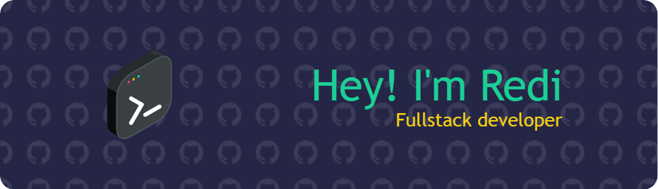

# Hello, World!

I'm a passionate self-taught developer who loves to create and innovate. I never stopped learning new skills and technologies. I'm confident in my abilities and always eager to take on new challenges. I enjoy solving problems and finding the best solutions for any project. Whether it's building a website, or an app, I always strive to deliver high-quality work. I'm always open to feedback and collaboration, and I'm always looking for new opportunities to grow and improve as a software developer.

<!--
**rediahmds/rediahmds** is a ✨ _special_ ✨ repository because its `README.md` (this file) appears on your GitHub profile.

Here are some ideas to get you started:

- 🔭 I’m currently working on ...
- 🌱 I’m currently learning ...
- 👯 I’m looking to collaborate on ...
- 🤔 I’m looking for help with ...
- 💬 Ask me about ...
- 📫 How to reach me: ...
- 😄 Pronouns: ...
- ⚡ Fun fact: ...
-->
