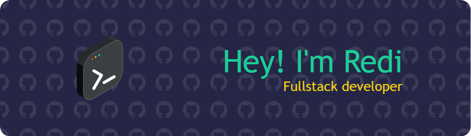

## 👋 Hello, World!

- 👨‍💻 Self-taught developer who is pursuing to become a full-stack web developer
- 🌱 Currently learning backend development with node.js and DSA
- ⚡ Fun fact: Big fan of Real Madrid C.F and enjoy watching movies
- 🧩 Loves solving problems, that is why I also enjoy competitive programming.

## Technologies I've Worked With

<!--
**rediahmds/rediahmds** is a ✨ _special_ ✨ repository because its `README.md` (this file) appears on your GitHub profile.

Here are some ideas to get you started:

- 🔭 I’m currently working on ...
 ...
- 👯 I’m looking to collaborate on ...
- 🤔 I’m looking for help with ...
- 💬 Ask me about ...
- 📫 How to reach me: ...
- 😄 Pronouns: ...
- ⚡ Fun fact: ...
-->

## Stats

